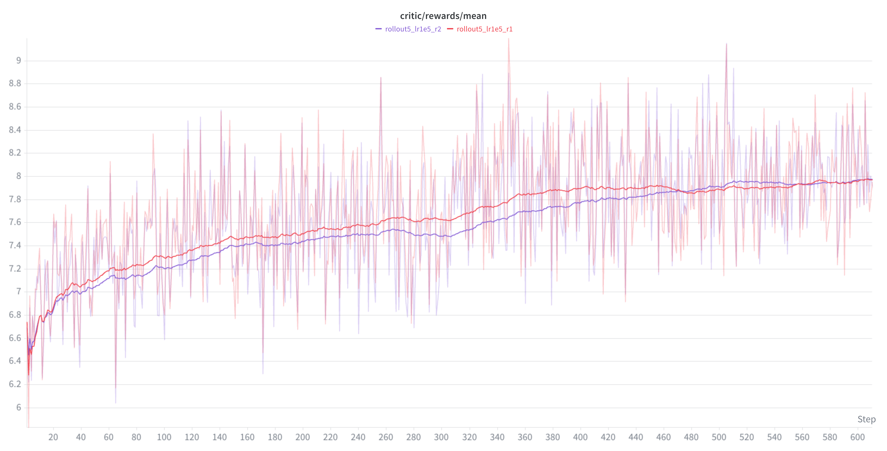

## Less Is More: Elevating RAG via Performance-Driven Context Compression

## 0. Data Download
The data for the distillation and RL training is awailable at
https://drive.google.com/drive/folders/1OMKuh7Mj5_Jf45yrPBtP1Apw8A16LiM6?usp=sharing

## 1. Distillation for Warm-Start
The implementation for the distillation stage is based on the [LLaMA Factory](https://github.com/hiyouga/LLaMA-Factory) framework. Please refer to their documentation for environment setup.

After completing the setup and placing the downloaded data into the data directory, execute the following commands to begin distillation training:

```bash
cd LLaMA-Factory
llamafactory-cli train examples/train_full/qwen_full_sft_nq_lr5e5_epoch2_bs128.yaml
```

## 2. Performance-Driven RL Training



**Figure: Reward trajectories from two separate training runs. The rewards increase steadily and eventually stabilize, suggesting stable training and convergence.**


<br><br>
Our RL training implementation is built upon the [verl](https://github.com/volcengine/verl) framework.

1. **Deploy the LLM for Reward Calculation:**
   
    First, run `reward_llm_serve.sh` to deploy the QA LLM. This model is responsible for generating answers, which are subsequently used for reward calculation.

2. **Configure the Reward Service:**
   
    Please update the `verl_core/reward.yaml` configuration file with your specific vLLM deployment IP address and the model name.

3. **Update the Configuration Path:**
   
    Then, navigate to line 105 in the file `verl_core/verl/workers/reward_manager/api_prime.py`, where you will find the following line of code:
    ```python
    config_path = "verl_core/reward.yaml"
    ```
    Ensure this `config_path` variable points to the correct location of your modified `reward.yaml` file.

4. **Run the Training Script:**
   
    Start RL training by running the script below.
    ```bash
    cd verl_core/examples/grpo_trainer
    sh train_compressor_nq.sh
    ```
